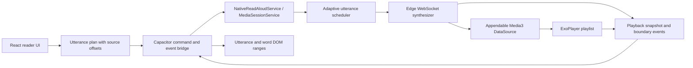

# Spec: Native Edge-style Read Aloud for Android

## Objective

Replace the current file-complete, plugin-owned Edge TTS playback flow with an Android-native playback session that behaves like Microsoft Edge Read Aloud:

- playback starts from the first decodable audio bytes instead of waiting for the full utterance;
- paragraph navigation, utterance highlighting, and word highlighting are separate concepts;
- the active session survives Activity/WebView recreation and screen-off playback;
- buffering, retry, seeking, completion, and failure have explicit observable states.

The target user is a Stories Reader user listening to Vietnamese serialized fiction with the Hoai My neural voice.

## Approved Architecture

The user selected **Option B: Media3 native service** on 2026-10-05. This selection authorizes adding the required Android Media3 playback/session dependencies when implementation begins. It does not authorize commit, push, deployment, or production changes.



### Ownership

- React owns source text, DOM mapping, persisted resume position, and visual highlighting.
- The Capacitor plugin owns only command translation and event delivery.
- `NativeReadAloudService` owns the playback session, Media3 player, MediaSession, audio focus, wake lock, synthesis jobs, and session snapshot.
- The synthesizer owns the Edge WebSocket protocol and emits audio bytes plus normalized word-boundary metadata.
- The scheduler owns request priority and bounded buffering.

## Behavioral Contract

### Utterance input

```ts
interface ReadAloudUtterance {
  id: string;
  paragraphIndex: number;
  sourceStart: number;
  sourceLength: number;
  text: string;
}
```

- Paragraph is the Previous/Next navigation unit.
- Utterance is the synthesis, playlist, and blue-highlight unit.
- Word boundary is the yellow-highlight unit.
- Utterances preserve exact offsets into the paragraph's rendered plain text.
- Target utterance size is 160 characters; the hard limit is 220 characters.
- Sentence/clause boundaries are preferred over hard character cuts.

### Playback state

```text
IDLE -> CONNECTING -> BUFFERING -> PLAYING
                          |          |
                          v          v
                       SEEKING <-> PAUSED
                          |
                          v
                  COMPLETED | ERROR
```

Every event carries a session id. Callbacks from an older session are ignored. Reconnecting UI clients receive the latest complete snapshot before incremental events.

### Highlight behavior

- The utterance range remains blue while its words are spoken and may span multiple visual lines.
- Only the active word range is yellow.
- Moving to the next word must not recreate the utterance range.
- Auto-scroll occurs only when the active utterance leaves the safe viewport.
- User touch/scroll suppresses automatic scrolling for at least 1.2 seconds.

### Buffering and retry

- The current utterance always has priority over lookahead work.
- Buffering is controlled by audio duration: low watermark 4 seconds, target 10-12 seconds.
- Playback starts as soon as Media3 has enough bytes to decode the current utterance.
- Retry is bounded exponential backoff with jitter.
- Exhausted retries emit an actionable error. Skipping an utterance is explicit, logged, and visible to the UI.

## Success Criteria

- Tap-to-first-audio: P50 <= 600 ms warm and <= 1.2 s cold on a stable normal network.
- Inter-utterance silence: P95 <= 80 ms.
- Word-highlight drift relative to the audio clock: P95 <= 150 ms.
- Playback and lock-screen controls survive screen-off and Activity/WebView recreation.
- No silent buffering period longer than 2 seconds without a buffering, retry, or error event.

## Compatibility and Migration

- Preserve existing `playChapter`, pause, resume, stop, and seek commands during rollout.
- Accept the legacy `chunks` payload until `utterances` is proven on-device.
- Read legacy `{ chunkIndex, charOffset }` resume data and rewrite it to paragraph/source offsets after the first successful event.
- Keep current reader settings keys compatible. Buffer implementation becomes an internal policy; do not expose a non-functional RAM/disk switch.
- No public gateway API, database schema, or deployment topology change is included.

## Tech Stack and Dependencies

- React 19, TypeScript 5.8, Capacitor 8.
- Android Java implementation, OkHttp WebSocket.
- Add aligned Media3 artifacts for ExoPlayer and MediaSessionService during implementation.
- Use the repository's existing JUnit, Vitest, and Android test infrastructure.

## Commands

Run from `stories-reader/` unless noted:

```bash
rtk npm test -- src/services/__tests__/edgeTtsNativeStream.test.ts src/hooks/__tests__/useReadAloudStreaming.test.ts src/services/__tests__/domWordHighlighter.test.ts
rtk npm run lint
rtk npm run build
cd android
rtk env JAVA_HOME=/Users/vula/.jdks/jdk-21.0.12.1+1/Contents/Home ANDROID_HOME=/Users/vula/Library/Android/sdk ./gradlew :app:testDebugUnitTest
```

## Project Structure

- `src/hooks/useReadAloud.ts`: UI orchestration and resume lifecycle.
- `src/services/`: utterance planning, native bridge, DOM ranges, and scroll behavior.
- `android/app/src/main/java/com/vula/stories/`: Capacitor plugin registration and bridge.
- `android/app/src/main/java/com/vula/stories/player/`: service, Media3 session, scheduler, and player state.
- `android/app/src/main/java/com/vula/stories/tts/edge/`: Edge protocol, audio source, boundaries, and retry policy.

## Code Style

- Use flat guard clauses; do not nest conditionals beyond one level.
- Keep a single top-level error boundary per asynchronous operation.
- Use immutable DTOs at the TypeScript/Capacitor/native boundary.
- Do not silently swallow synthesis, decoder, player, or service errors.
- Keep story text out of routine remote logs; use ids, timings, sizes, and truncated diagnostic snippets only where already allowed.

## Testing Strategy

- Vitest: segmentation offsets, legacy migration, event ordering, highlight ranges, UI state, and cleanup.
- JVM tests with fakes: state machine, stale-session rejection, scheduler priority, buffering thresholds, retry, and snapshot replay.
- Android integration tests: service lifecycle, MediaSession commands, audio focus, and Activity recreation.
- Device QA: Hoai My voice, screen-off, Bluetooth controls, phone-call interruption, slow network, seek spam, and long chapters.
- Record cold/warm first-audio latency, gap duration, rebuffer count, and highlight drift before and after migration.

## Boundaries

- Always: preserve the existing command contract until the new flow passes device QA.
- Always: add focused failing tests before each behavior change.
- Ask first: any gateway/API change or dependency beyond the approved Media3 artifacts.
- Never: commit, push, deploy, or remove the legacy fallback without explicit authorization.
- Never: treat the consumer Edge endpoint/token as a stable public contract.

## Out of Scope

- Migrating to paid Azure Speech SDK or introducing API-key management.
- Changing the gateway, TTS provider, voice catalog, or production infrastructure.
- Redesigning general reader controls or background music.
- Persisting synthesized story audio as a durable offline library.

## Open Questions for Device Validation

- Which minimum Android/API versions in the supported device set need explicit performance baselines?
- Does the current Edge endpoint deliver MP3 frames that Media3 can decode progressively without waiting for stream completion on every supported device?
- What fallback threshold should switch from progressive streaming to completed-file playback after decoder incompatibility?
