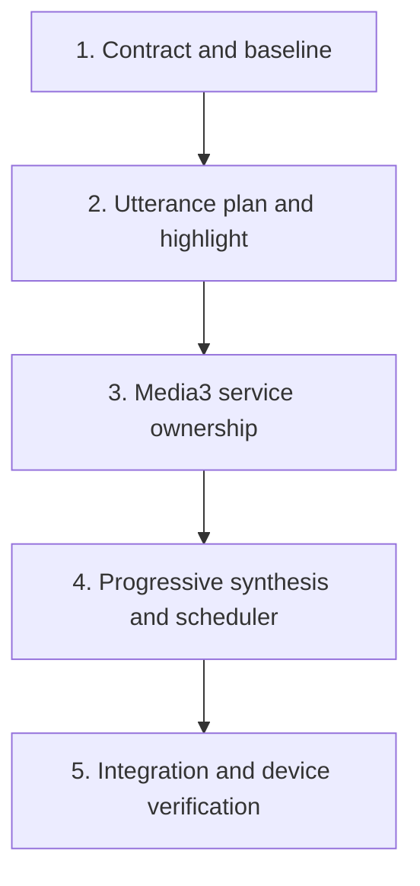

# Implementation Plan: Native Edge-style Read Aloud

## Overview

Build an Edge-like Android Read Aloud pipeline in vertical slices. The migration keeps the current Capacitor commands working until the Media3 service is verified on real devices. Tasks are tracked in `tasks/todo.md`; the approved behavioral contract is `tasks/SPEC-native-edge-read-aloud.md`.

## Architecture Decisions

- Make a foreground Media3 session service the single playback owner.
- Separate paragraph navigation, utterance synthesis, and word highlighting.
- Start playback from progressive audio bytes; completed-file playback remains a temporary compatibility fallback.
- Use audio-duration watermarks instead of a fixed number of prefetched chunks.
- Publish one replayable playback snapshot plus ordered session-scoped events.

## Dependency Order

## Milestones

### Milestone 1: Contract and measurable baseline

Define DTOs, session states, compatibility behavior, and latency measurements. Add failing tests for event ordering, stale sessions, legacy input, and resume migration before production logic changes.

Estimated implementation time: 0.5-1 day.

### Milestone 2: Edge-style text and highlight model

Generate source-mapped utterances from paragraph text, wire dual utterance/word ranges, and keep the existing player underneath. This slice must already deliver correct Edge-style highlighting without depending on Media3.

Estimated implementation time: 1 day.

### Checkpoint A

- Focused Vitest suite passes.
- Existing Edge/native/browser engine selection remains compatible.
- Long Vietnamese paragraphs preserve exact DOM offsets.

### Milestone 3: Native Media3 session ownership

Add the approved Media3 dependencies. Move player/session lifecycle, MediaSession, audio focus, wake lock, and playback snapshot into a foreground service. Keep the existing complete-file audio source initially so lifecycle behavior can be verified independently from streaming.

Estimated implementation time: 1-1.5 days.

### Milestone 4: Progressive audio and adaptive scheduling

Implement the appendable Media3 data source, queue utterances as playlist items, prioritize current audio, and maintain duration-based watermarks. Add bounded retry with jitter and explicit rebuffer/error events. Retain completed-file fallback behind an internal capability decision.

Estimated implementation time: 1.5-2 days.

### Checkpoint B

- JVM/unit suites pass.
- Screen-off and Activity recreation preserve playback.
- First-byte playback and seamless playlist transition work on a physical device.

### Milestone 5: Integration, cleanup, and release evidence

Connect React state to replayable snapshots, migrate resume data, remove duplicate active-path ownership, and verify performance/error behavior across the device matrix. Do not remove the legacy fallback until the acceptance metrics pass.

Estimated implementation time: 1-1.5 days.

## Risks and Mitigations

| Risk                                                        | Impact | Mitigation                                                                                               |
| ----------------------------------------------------------- | ------ | -------------------------------------------------------------------------------------------------------- |
| Edge consumer protocol changes                              | High   | Isolate protocol behind a synthesizer interface; keep explicit error state and provider replacement seam |
| Progressive MP3 extraction differs by device                | High   | Prove with a tracer bullet first; keep completed-file fallback                                           |
| Service/plugin event loss during Activity recreation        | High   | Store and replay an immutable session snapshot                                                           |
| Offset drift after text normalization                       | Medium | Segment from rendered plain text and property-test source ranges                                         |
| Aggressive prefetch wastes bandwidth or triggers throttling | Medium | Use duration watermarks, current-first priority, bounded concurrency, and jitter                         |

## Verification Gate

- Run focused tests after every task.
- Run full `npm test`, `npm run lint`, `npm run build`, and Android unit tests at both checkpoints.
- Perform physical-device QA before removing any fallback.
- Review the final diff for unrelated changes and logging of story content.

## Approval Gate

No implementation begins until the user approves this saved spec and task breakdown. Commit, push, deployment, and production access remain unauthorized.
